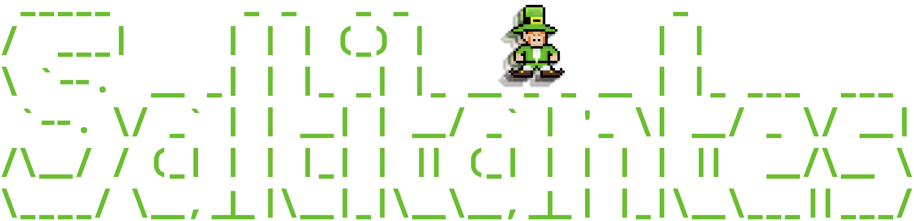

> Saltitantes é uma resolução, em Java, do problema dos duendes saltitantes. Este projeto foi motivado pela disciplina de Teste de Software na UFERSA.


# 1. Problema e Requisitos
Implementem, em Java, uma simulação de criaturas saltitantes, conforme requisitos, a seguir:

- A simulação compreende $n$ criaturas, numeradas de $1$ a $n$.
- Para cada criatura $i$, $1 ≤ i ≤ n$, a simulação mantém uma quantidade de moedas de ouro $g_i$, cujo valor inicial é um milhão.
- A simulação mantém, ainda, para cada criatura $i$, um lugar no horizonte, que é representado com um número de ponto flutuante de dupla precisão, $x_i$.
- Em cada iteração da simulação, as criaturas são processadas na ordem.
- O processamento de uma criatura em uma iteração inicia pela computação de um novo lugar no horizonte para $i$, que é determinado por $x_i ← x_i + rg_i$, onde $r$ é um número de ponto flutuante gerado aleatoriamente dentro do intervalo $−1$ e $1$. A criatura $i$ então rouba metade das moedas de ouro da criatura mais próxima de um dos seus lados e adiciona esta quantidade em seu respectivo $g_i$.
- A simulação deve permitir a visualização gráfica de uma série de iterações para um dado número n de criaturas. 


# 2. Resolução Proposta
Esta resolução conta com a implementação de um **treemap** para gerenciar as posições das criaturas, permitindo a busca da criatura mais próxima de forma eficiente. A cada iteração, a posição de cada criatura é atualizada e a quantidade de moedas é ajustada conforme as regras do problema.

## 2.1 Tecnologias Usadas
Para este projeto, foram utilizadas as seguintes tecnologias:
- Java 21
- Swing para a interface gráfica
- JUnit para testes

## 2.2 Estrutura do Projeto
A arquitetura do projeto segue um padrão MVC (Model-View-Controller) para melhor organização sem adição desnecessária de complexidade. 

Sendo assim, a estrutura de diretórios dos arquivos _source_ seguem:
```
src
├── Main.java
├── Controller
│   └── SimulationController.java
├── datastructure
│   └── TreeMapAdaptado.java
├── model
│   └── Duende.java
├── resources
│   └── sprites
│       └── duende.png
└── view
    ├── MenuView.java
    └── SimulationView.java
```

Para os arquivos de teste, a estrutura de diretórios é a seguinte:
```
test
├── DuendeTest.java
├── SimulationControllerTest.java
└── TreeMapAdaptadoTest.java
```

## 2.3 Paralelismo
A visualização gráfica da simulação é atualizada em tempo real. Para isso, a execução das iterações é feita em uma thread separada, permitindo que a interface gráfica permaneça responsiva. 

A classe `SimulationController` é responsável por gerenciar essa execução paralela, utilizando o método `SwingUtilities.invokeLater()` para que as atualizações na interface gráfica sejam feitas na thread de eventos do Swing.

Para garantir que, ao atingir um critério de parada, a simulação interrompa imediatamente, sobrescrevemos a função `repaint()` da classe `JPanel` e a chamamos dentro do loop de execução, encapsulada pela thread de simulação.

# 3. Execução do Projeto

# 3.1 Setup
Para executar o projeto, siga os passos abaixo:
1. Certifique-se de ter o Java 21 instalado em sua máquina.
2. Clone o repositório:
   ```bash
   git clone https://github.com/eduardopvieira/software-testing
    cd software-testing
    ```
3. Navegue até o diretório do projeto
4. Compile o projeto

# 3.2 Execução e configuração da simulação
1. Execute a `main()` presente em `Main.java`:
2. O menu inicial será exibido, permitindo que você escolha o número de criaturas, o máximo de ouro, e o limite do horizonte.
>Obs.: O máximo de moedas e o limite do horizonte serão critérios de parada da simulação.
3. Clique em "Iniciar Simulação" para começar a simulação.
4. A simulação será exibida em uma nova janela, mostrando as criaturas saltitantes e suas respectivas quantidades de moedas.
5. Ao final da simulação será exibido um resumo do estado final das criaturas.


# 4. Testes
Os testes foram implementados utilizando o JUnit 5. Todos estão localizados no diretório `test/` e incluem:
- Testes unitários
- Testes de pré-condições e pós-condições
- Testes de branchs